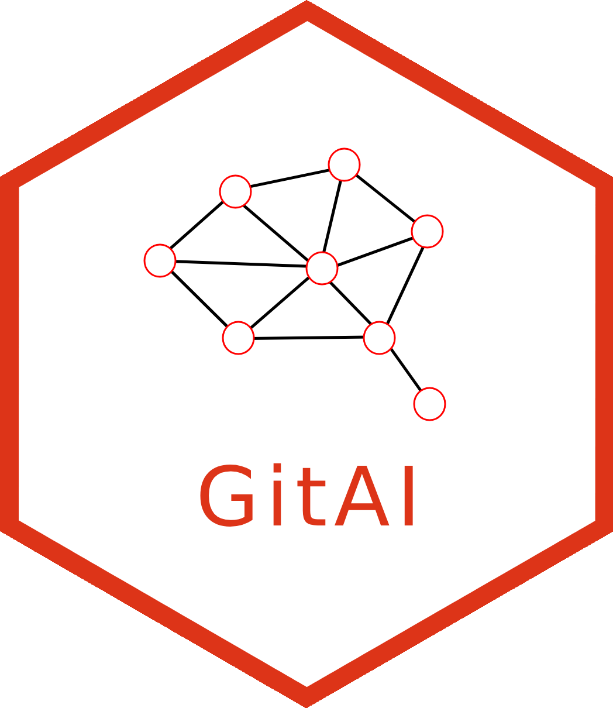

<!-- README.md is generated from README.Rmd. Please edit that file -->

# GitAI 

<!-- badges: start -->

[](https://app.codecov.io/gh/r-world-devs/GitAI)
<!-- badges: end -->

The goal of GitAI is to derive knowledge from GitHub or GitLab
repositories with the use of AI/LLM (Large Language Models). With GitAI
you can easily:

- set up your project scope (Git repositories),
- select content of interest (files and file types),
- choose your LLM backend,
- define the LLM prompts,
- process content of all repositories with a single function call.

And all of that in a nice tidyverse style.

## Installation

You can install the development version of `GitAI` from
[GitHub](https://github.com/) with:

``` r
# install.packages("pak")
pak::pak("r-world-devs/GitAI")
```

## Example workflow

Basic workflow could look like:

``` r
library(GitAI)
# Set up project
verbose_off()
my_project <- initialize_project("fascinating_project") |>
  set_github_repos(repos = c("r-world-devs/GitStats", "r-world-devs/GitAI", "openpharma/DataFakeR")) |>
  add_files(files = "README.md") |>
  set_llm() |>
  set_prompt("Write one-sentence summary for a project based on given input.")

# Get the results
results <- process_repos(my_project)
purrr::map(results, ~.$text)
#> $GitStats
#> [1] "GitStats is an R package that enables users to extract and analyze GitHub and GitLab data, such as repository details, commits, and user activity, in a standardized table format."
#> 
#> $GitAI
#> [1] "GitAI is an R package designed to harness the power of AI and Large Language Models to extract insights from GitHub or GitLab repositories in a user-friendly, tidyverse style, enabling users to set project scopes, select content of interest, and process repositories with ease."
#> 
#> $DataFakeR
#> [1] "DataFakeR is an experimental R package designed to generate fake data samples that maintain specified characteristics of original datasets, streamlined through customizable configurations and schema management."
```
